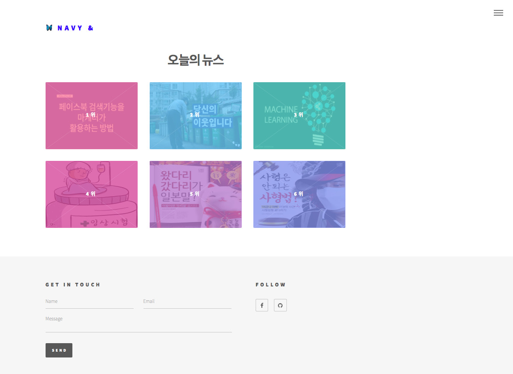
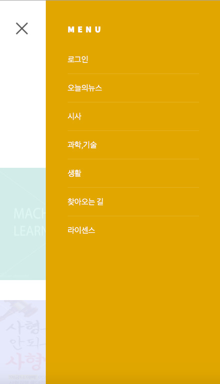
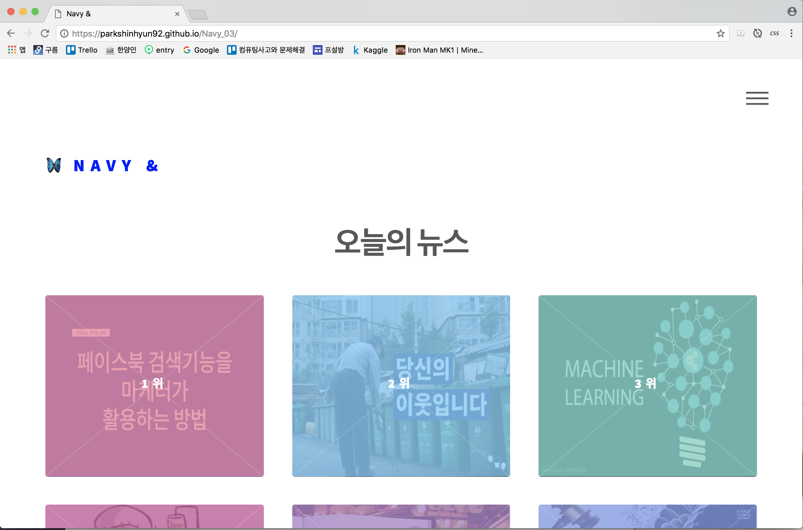
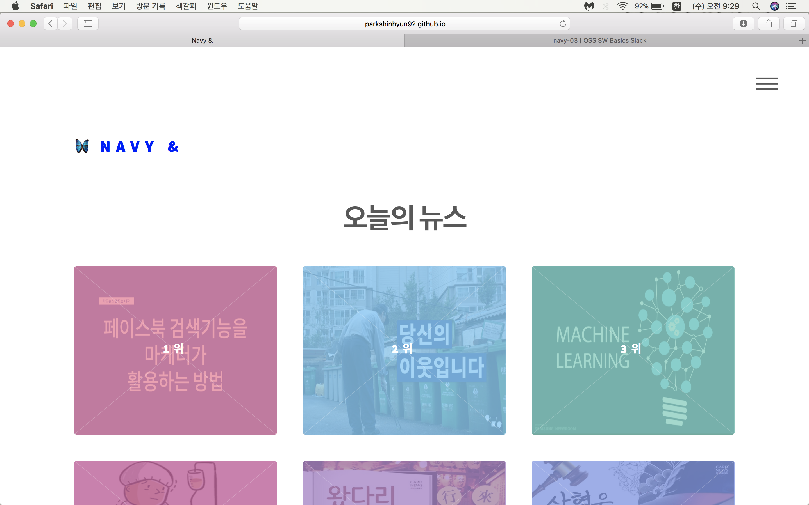
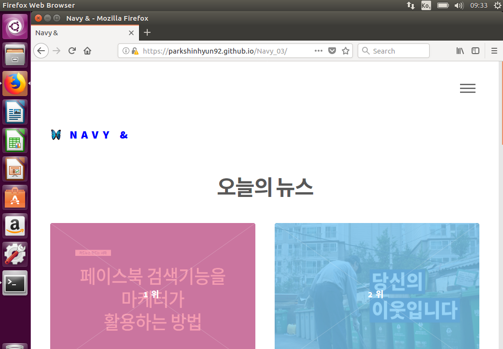

# Navy_03

## navy&

> navy& by OSSW Basic 2017 team Navy 03  
> Free for personal and commercial use under the Apache 2.0 license
>> 이 문서는 카드뉴스 사용자를 위해 만들어졌습니다.  
>> 문의 사항이 있으시면 guengdongnany@gmail.com 으로 메일 바랍니다.  

## 사이트 접속
> https://ParkShinHyun92.github.io/Navy_03

## 사용 방법

- 초기화면
> 사이트에 접속하시면 보이는 초기화면 입니다. 왼쪽 상단의 NAVY &를 누르시면 언제든지 초기화면으로 돌아갈 수 있으며 오른쪽 상단의 버튼을 누르시면 메뉴바가 나타납니다. 페이지 중앙에는 카드뉴스를 볼 수 있는 버튼이 마련되어 있습니다. 또한 오른쪽 하단에는 좌우로 FOLLOW 버튼이 있는데 왼쪽은 Facebook에서, 오른쪽은 Github에서 follow가 가능합니다.

- 메뉴바
> 오른쪽 상단의 메뉴바를 누르시면 다음과 같이 보여집니다. 메뉴바에는 로그인과 각종 카테고리 별 뉴스, 길 안내와 라이센스로 나누어집니다. 메뉴바에서 **X** 표시를 누르시면 메뉴바가 다시 사라집니다.

- 이동 버튼
> 카드뉴스를 전 페이지 혹은 다음 페이지로 넘기려면 사진에 보이는 **<** 표시나 **>** 표시를 클릭하셔야 됩니다. 또한 특정 페이지로 한 번에 이동하고 싶으시다면 밑에 동그란 부분을 누르시면 그 페이지로 이동합니다.

- 크롬, 사파리, 파이어 폭스 브라우저에서는 구동이 됨을 확인.
