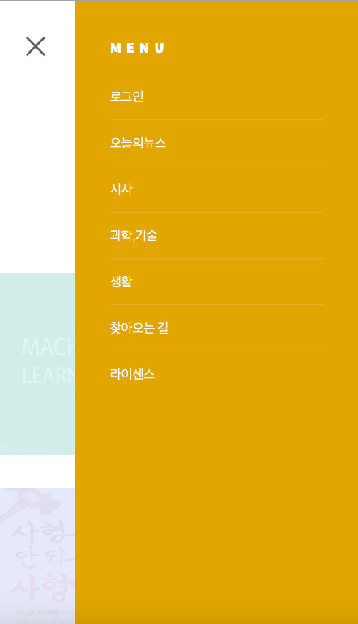
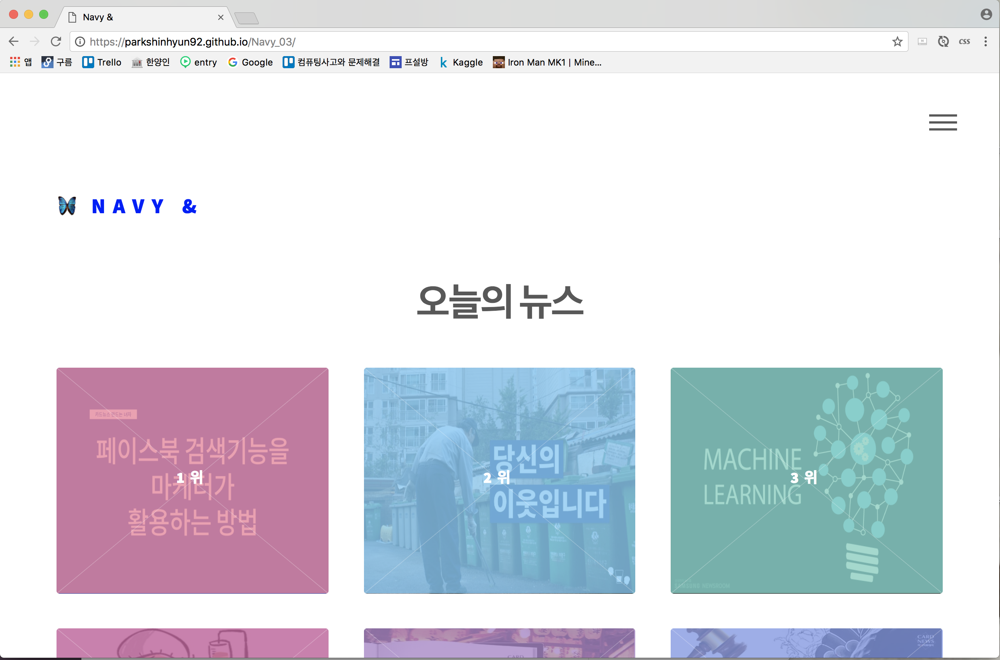

# Navy_03

## navy&

> navy& by OSSW Basic 2017 team Navy 03  
> Free for personal and commercial use under the Apache 2.0 license
>> This document is created for card news user.  
>> If you have any question please send mail to guengdongnany@gmail.com

## Enter the Site
> https://ParkShinHyun92.github.io/Navy_03

## How to Use

- initial screen
> This is the initial screen when you access the site. if you click **NAVY&** in the upper left corner, you can return to the initial screen at any time and if you click the button in the upper right corner, the menu bar appear. At the center of the page, there is a button to view the card news. In addition there is a FoLLOW button on the bottom right, which can be followed by Facebook on the left side and Github on the right side.

- Menu bar
> If you click menu bar in the upper right corner, you can see upper image. The menu bar is divided into login, news by category, directions and licenses. When you click **X** on the menu bar, the menu bar disappears again.

- Page move button
> If you want to move card news previous or next, you should click button **<** mark or **>** mark. In addition If you want to move to a specific page at once, just click yellow circle.

- We confirm to operate on Chrome, Safari and FireFox
